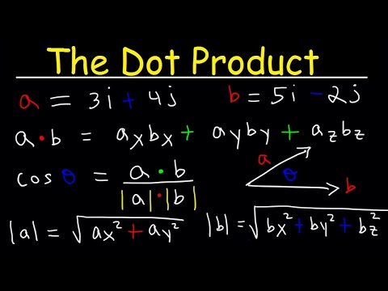

# Vector dot product
# table of content of items donw in this 
1. Introduction
2. Vector Dot Product Formula
3. Vector Dot Product Example
4. Vector Dot Product in Python
5. Conclusion
## mathematical formula
*vector dot product*
$$
\mathbf{a} \cdot \mathbf{b} = |a| |b| \cos(\theta)
$$
- [x] **a** and **b** are the vectors.
- [x] **|a|** and **|b|** are the magnitudes of the vectors.
- [x]**θ** is the angle between the two vectors.
> dot product can be used to find angle between vectors.
> [!NOTE]  
> check angles carefully and vector directions.
##image

## code snippet
```python
import numpy as np

def dot_product(a, b):
    return np.dot(a, b)

# Example vectors
a = np.array([1, 2, 3])
b = np.array([4, 5, 6])

# Calculate dot product
print(dot_product(a, b))
```
## algorithm comparison table
| Algorithm | Time Complexity | Space Complexity | Description |
| --- | --- | --- | --- |
| - Dot Product | O(n) | O(1) | Calculate the dot product of two vectors
| - Vector Magnitude | O(n) | O(1) | Calculate the magnitude of a vector
| - Vector Angle | O(n) | O(1) | Calculate the angle between two vectors
## footnote
To know more about vector dot product.[^5]

[^5]: Find more info [here](https://byjus.com/maths/dot-product-of-two-vectors/).

